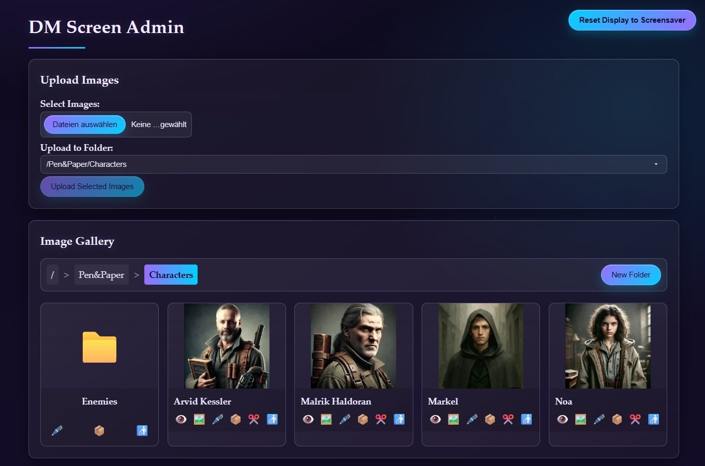
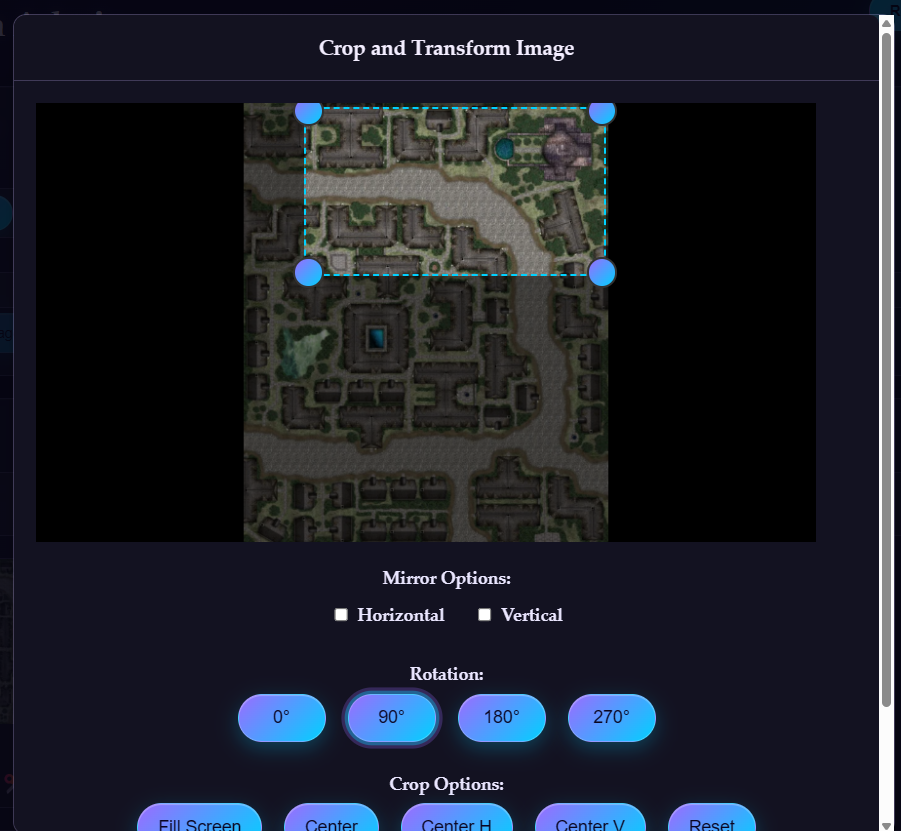

# 🧙‍♂️ The Arcane DM Screen 🐉

*A magical artifact for Dungeon Masters of exceptional power*

> "In the hands of a skilled Dungeon Master, this arcane device can transport adventurers to distant realms, reveal ancient maps, and bring fearsome creatures to life before their very eyes." — *Elminster of Shadowdale*

## 📜 The Scroll of Knowledge

The Arcane DM Screen is a simple but powerful digital tool that enhances your tabletop role-playing experience. As a Dungeon Master, you can control what your players see during your campaign, displaying character portraits, monster images, maps, and other visual aids with the flick of a wand (or click of a mouse).

This mystical device allows you to maintain the atmosphere of your adventure while providing visual context to your players, all controlled from your own administrative interface that remains hidden from their prying eyes.



## ✨ Magical Properties

- **Dual-Interface Enchantment**: Separate admin and view interfaces, allowing the DM to control what players see
- **Image Repository of Holding**: Upload and manage an (un)limited collection of images
- **Instant Transmission Spell**: Live updates to the player view using polling magic
- **Arcane Thumbnail Creation**: Automatic generation of thumbnails for faster loading
- **Dimensional Constraint Spell**: Automatically resizes large images to a maximum of 1920px width/height when displaying, keeping the original size stored
- **Parallel Processing Enchantment**: Processes multiple images simultaneously using parallel threads for faster uploads
- **Arcane Caching Enchantment**: Stores resized images in a cache for lightning-fast retrieval on subsequent requests
- **Optimized Resizing Ritual**: Uses high-performance image resizing algorithms for faster processing, especially on Raspberry Pi
- **Screensaver Illusion**: Configure a default image to display when no specific image is selected
- **Mystical WiFi Configuration**: Set up network connectivity for your magical device
- **Rotation Cantrip**: Rotate images to the perfect orientation
- **Renaming Ritual**: Change image names to suit your campaign needs
- **Folders of Holding**: Create an unlimited number of folders for all your campaigns



## 🧪 Alchemical Requirements

To brew this potion, you will need:

- Python 3.7 or higher
- Flask and Flask-SocketIO
- Pillow (for image processing)
- A web browser with JavaScript enabled
- A network connection (for multi-device setups)

## 🔮 Summoning the DM Screen

### Standard Installation

1. Create a virtual environment in a folder of your choice
   ```
   uv init
   uv venv
   ```
2. Install the arcane artifact directly:
   ```
   uv pip install git+https://github.com/Marcinkowski-D/dmScreen.git
   ```

3. Invoke the screen with the ancient command:
   ```
   python -m dmScreen.server
   ```

4. Open your browser and navigate to:
   - Admin interface: `http://your-screen-ip:5000/admin`
   - Player view: `http://localhost:5000/view`

## 🧙‍♂️ Wielding the Power

### For the Dungeon Master

1. Access the admin interface at `http://your_ip:5000/admin`
2. Upload images of characters, monsters, maps, or other visual aids
3. Click on an image in the gallery to display it to your players
4. Configure a screensaver image for when no specific image is displayed
5. Use the WiFi configuration to set up network connectivity if needed

### For the Players

1. Access the view interface at `http://localhost:5000/view`
2. Behold the visual wonders shared by your Dungeon Master
3. Marvel at the seamless transitions as new images appear

## 🗝️ Advanced Enchantments

### Image Caching System

The DM Screen employs a powerful caching system to dramatically improve image loading performance, especially on Raspberry Pi devices:

1. Resized images are automatically stored in a cache folder (`data/cache`)
2. Subsequent requests for the same image at the same size are served directly from cache
3. The cache is automatically cleaned up periodically to prevent excessive disk usage
4. Old cache files (older than 24 hours) are automatically removed
5. If the cache exceeds 500MB, the oldest files are removed first

This caching system reduces image loading times from ~3 seconds to near-instant on Raspberry Pi devices.

### Network Configuration

By default, the server binds to `0.0.0.0`, making it accessible to other devices on your network:

1. Configure the WiFi settings in the admin interface
2. Access the view interface from other devices using your server's IP address

### Portability Enchantment

The arcane artifact possesses a powerful nomadic enchantment, allowing it to adapt to different magical realms:

- The artifact attempts to reconnect to the last known mystical network (WiFi) it was bound to
- If no familiar network is detected, it creates its own magical aura (adhoc network) with customizable incantations (credentials configurable via .env)
- You may commune with the artifact while connected only to its magical aura (IP 192.168.4.1:PORT) without requiring external magical sources
- Alternatively, you can inscribe new network runes via the enchanted scroll at the bottom of the arcane interface

This nomadic enchantment ensures that when you transport your screen to fellow wizards' towers, you may either use it in isolation or bind it to any local magical network.

#### Prerequisites for Adhoc Network Functionality

To enable the magical aura (adhoc network) functionality, you must first install these mystical components:

```
sudo apt-get install hostapd dnsmasq
```

These components are required for creating and managing the adhoc network when no WiFi connection is available.

## 🧩 Contributing to the Grimoire

Contributions to enhance this magical artifact are welcome! If you wish to add new spells (features) or fix cursed bugs:

1. Fork the repository
2. Create a feature branch (`git checkout -b feature/amazing-feature`)
3. Commit your changes (`git commit -m 'Add some amazing feature'`)
4. Push to the branch (`git push origin feature/amazing-feature`)
5. Open a Pull Request

## 📜 The Arcane License

This project is licensed under the MIT License - see the LICENSE file for details.

---

*Created with arcane wisdom by a Dungeon Master, for Dungeon Masters.*

*May your dice roll high and your players be forever entertained!*

## 🖥️ Raspberry Pi 3B+ Setup - Kiosk Mode & Autostart

*A powerful enchantment for those wielding the Raspberry Pi 3B+ or faster magical artifacts (requires 1GB RAM for Chromium and WiFi connectivity)*

### Preparing Your Magical Device

1. Install Raspberry Pi OS with Desktop

2. Enable Autologin to Desktop:
   ```
   sudo raspi-config → System Options → Boot / Auto Login → Desktop Autologin
   ```
   *Reboot your magical device after this incantation*

3. Install the required mystical components:
   ```
   sudo apt update
   sudo apt install -y chromium-browser hostapd dnsmasq unclutter
   ```

### Enchanting the Browser with Kiosk Magic

1. Create the autostart directory:
   ```
   mkdir -p ~/.config/autostart
   ```

2. Create the kiosk configuration scroll:
   ```
   nano ~/.config/autostart/kiosk.desktop
   ```

3. Inscribe these magical runes into the scroll:
   ```
   [Desktop Entry]
   Type=Application
   Name=KioskBrowser
   Exec=chromium-browser --noerrdialogs --kiosk http://127.0.0.1:5000/view
   X-GNOME-Autostart-enabled=true
   ```
   *Save and close the scroll with Ctrl+X, Y, Enter*

4. Cast the Invisibility Spell on your cursor:
   ```
   sudo nano /etc/xdg/lxsession/LXDE-pi/autostart
   ```
   Add this line to the file:
   ```
   @unclutter -idle 0
   ```

### Binding the DM Screen to Your Device with Systemd Magic

1. Clone the repository to your home:
   ```
   cd ~
   git clone https://github.com/Marcinkowski-D/dmScreen.git
   ```

2. Make the startup script executable:
   ```
   cd dmScreen
   chmod a+x dmScreen-start.sh
   ```

3. Create the service scroll:
   ```
   sudo nano /etc/systemd/system/dmscreen.service
   ```

4. Inscribe these magical runes:
   ```
   [Unit]
   Description=DM Screen Server
   After=network.target

   [Service]
   User=root
   WorkingDirectory=/home/pi/dmScreen
   ExecStart=/usr/bin/bash dmScreen-start.sh
   Restart=always
   RestartSec=5
   Environment=PYTHONUNBUFFERED=1

   [Install]
   WantedBy=multi-user.target
   ```
   
   If you don't want to use the adhoc network feature, you can restrict the user to "pi" (or something else)

5. Activate the magical service:
   ```
   sudo systemctl daemon-reload
   sudo systemctl enable dmscreen.service
   sudo systemctl start dmscreen.service
   ```

6. Verify your enchantment is working:
   ```
   sudo systemctl status dmscreen.service
   ```

7. Complete the ritual with a final reboot and watch the magic happen:
   ```
   sudo reboot
   ```

### The Magical Result

Upon completion of this ritual, your Raspberry Pi will:
- Automatically start the DM Screen webserver at boot
- Launch Chromium in kiosk mode, displaying your DM Screen at http://127.0.0.1:5000/view
- Create a dedicated display for your players, free from distractions of the mortal operating system
- Create its own magical aura (adhoc network) if no WiFi connection is available